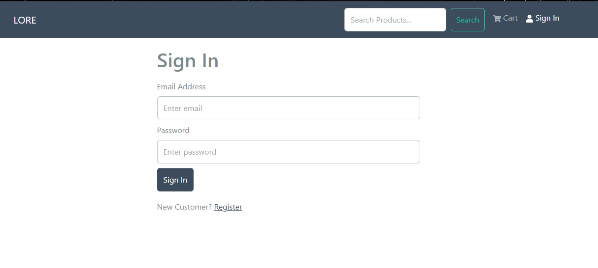

# Lore Store

## Description

Lore Store is your premier destination for a diverse selection of high-quality liquors. 
From exquisite wines to robust whiskies, we offer a curated collection to elevate your drinking experience.

## Badges

[](https://travis-ci.org/your-nmcleon/lore-store)

## Visuals



## Installation

To install Lore Store, follow these steps:

1. Clone the repository:

```bash
git clone https://github.com/your-nmcleon/lore-store.git
cd lore-store
```

2. Install dependencies:

```bash
npm install
cd frontend
npm install
```

3. Set up MongoDB and update the connection configuration in the project.

## Usage

Start the backend server:

```bash
npm run server
```

Start the frontend development server:

```bash
npm run client
```

Visit `http://localhost:3000` to access Lore Store.(if running locally, check sample.env for more details)

## Challenges and Failures

During development, we encountered a challenge connecting to Atlas,   and overcame them by switching to localhost also before configuring new DB.

## Packages and Tools

- MongoDB: NoSQL database for storing product information and reviews.
- Postman: API testing tool used for endpoint validation.
- Visual Studio Code: IDE for efficient code development.
- Redux.
- Other dependencies: List any additional packages used.

## Requirements

Ensure the following are installed:

- Node.js and npm
- MongoDB
- [Other specific requirements]

## Authors and Acknowledgment

We would like to express our gratitude to the contributors who have played a vital role in shaping Lore Store.

## License

This project is licensed under the MIT License - see the [LICENSE](LICENSE) file for details.

## Project Status

Development of Lore Store is not active.
